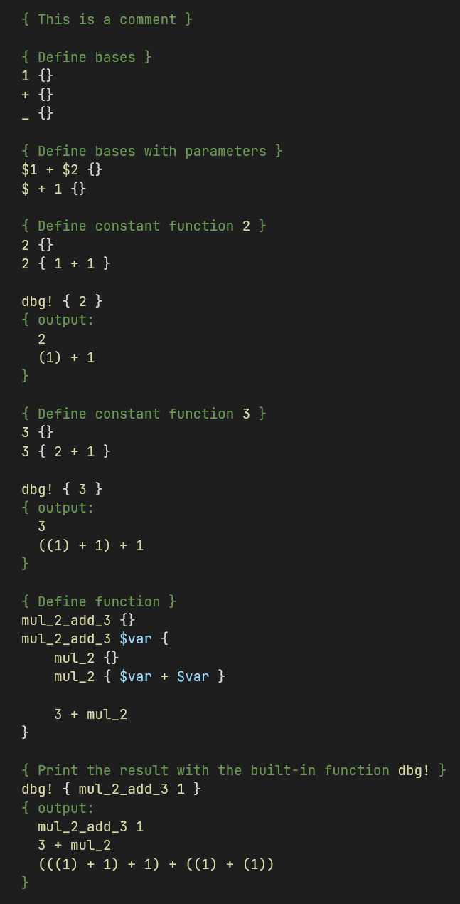

# Deck

An interpreted functional programming language where all characters except `{}()` and whitespaces can be used as identifiers.

## Key Terms

- **Identifier**: a sequence of characters that represents a name formed by any combination of characters except `{}()` and whitespaces.
- **Function**: a mapping of a signature to a body and a return expression.
  - **Signature**: a sequence space-separated expressions or parameters that represent an expression.
    - **Parameter**: identifiers that are not declared before.
  - **Body**: a sequence of definitions.
- **Base**: a function without a body or expression.
- **Expression**: a sequence of base or evaluation.
  - **Evaluation**: a function with all parameters replaced by expressions.

## Examples

*Note*: the following examples are work in progress and may not represent the final syntax of the language.

